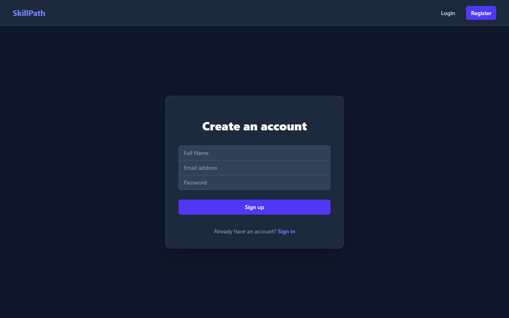
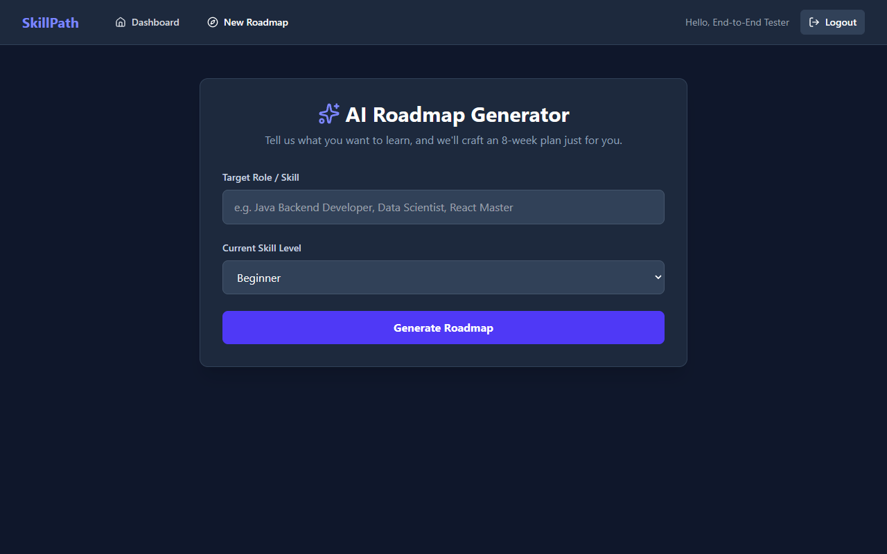
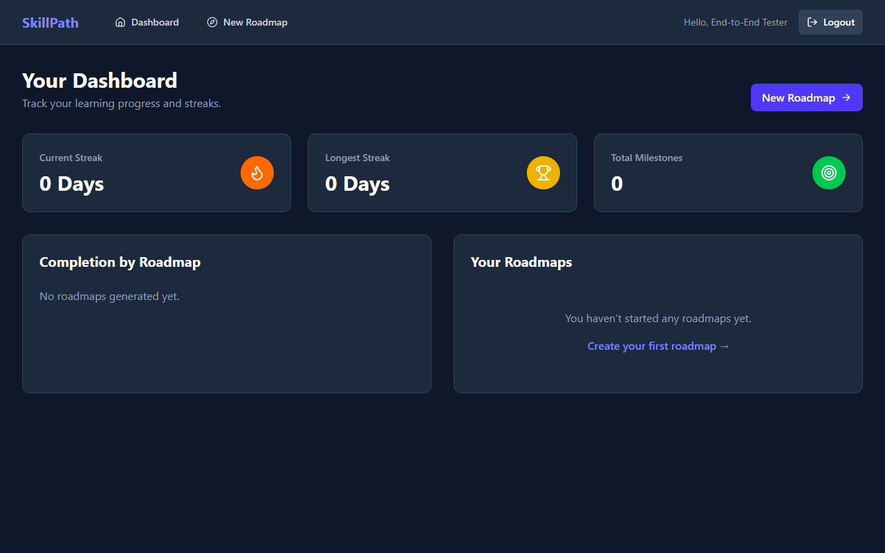
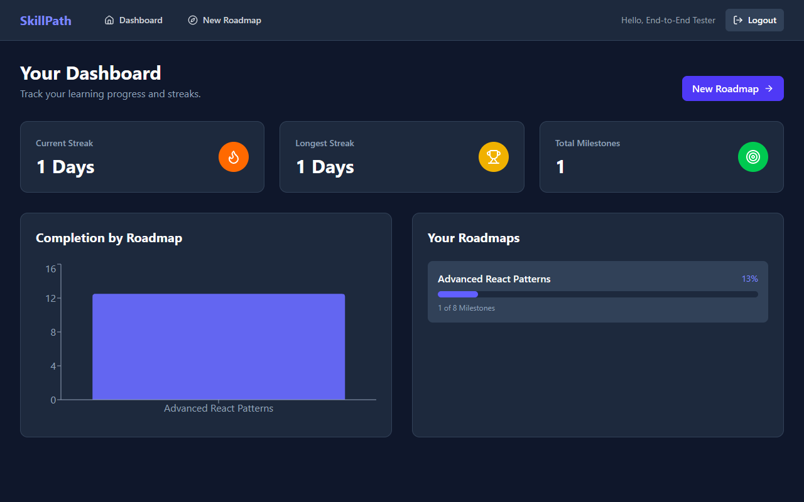
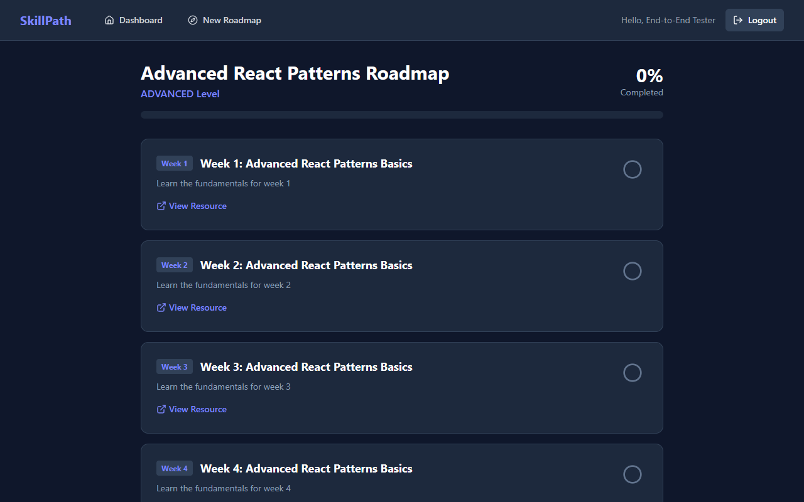

<div align="center">
  <h1>SkillPath — AI-powered personalized learning roadmap generator</h1>
  <p>An intelligent platform that creates personalized, week-by-week learning roadmaps using AI to help you achieve your career goals.</p>

  
  
  
  
  
  
</div>

## ✨ Features

- 🧠 **AI-Powered Generation:** Generates comprehensive 8-week learning roadmaps customized to your current skill level and target role using Google's Gemini AI.
- 🔐 **Secure Authentication:** JWT-based user authentication and authorization ensuring data privacy.
- 📈 **Progress Tracking:** Interactive milestones allow you to mark off completed weeks and see real-time progress.
- 🔥 **Gamified Streaks:** Encourages daily learning by tracking your current and longest learning streaks.
- 🎨 **Modern Interface:** A sleek, responsive, dark-mode-first UI built with React, Vite, and Tailwind CSS v4.
- 🐳 **Dockerized:** Fully containerized backend and database for 1-click local setup.

## 🏗 Architecture

The system follows a modern decoupled architecture:
1. **Frontend (React/Vite):** A single-page application hosted on Vercel. It communicates with the backend via RESTful APIs, passing a JWT in the `Authorization` header.
2. **Backend (Spring Boot 3):** A robust Java backend handling business logic. It integrates with the Gemini API via Spring WebClient/RestClient to generate roadmaps.
3. **Database (MySQL 8):** Relational database managing Users, Roadmaps, Milestones, and Progress Logs.
4. **Infrastructure:** Orchestrated locally via Docker Compose, utilizing a multi-stage Docker build for the Spring Boot application to ensure a minimal runtime footprint.

## 🚀 How to Run Locally

Prerequisites: [Docker](https://docs.docker.com/get-docker/) installed on your machine.

1. **Clone the repository**
   ```bash
   git clone https://github.com/yourusername/skillpath.git
   cd skillpath
   ```

2. **Configure Environment Variables**
   Create a `.env` file in the `skillpath-backend` directory based on the `.env.example`:
   ```bash
   cp skillpath-backend/.env.example skillpath-backend/.env
   # Edit .env to add your GEMINI_API_KEY and secure passwords
   ```

3. **Start the Infrastructure**
   Use Docker Compose to spin up the MySQL database and Spring Boot backend:
   ```bash
   docker-compose up --build -d
   ```
   *The backend will be available at `http://localhost:8080`.*

4. **Start the Frontend (Optional - if running React locally instead of Vercel)**
   ```bash
   cd skillpath-frontend
   npm install
   npm run dev
   ```

## 🔌 API Endpoints

| Method | Endpoint | Description | Auth Required |
| :--- | :--- | :--- | :---: |
| `POST` | `/api/auth/register` | Register a new user | ❌ |
| `POST` | `/api/auth/login` | Authenticate and receive JWT | ❌ |
| `POST` | `/api/roadmap/generate` | Generate an AI roadmap | ✅ |
| `GET` | `/api/roadmap/{id}` | Get specific roadmap details | ✅ |
| `PATCH`| `/api/milestone/{id}/complete`| Mark milestone complete | ✅ |
| `GET` | `/api/progress/streak` | Get current user streak | ✅ |

## 📸 Screenshots

### Register & Login


### Generate a Roadmap


### Dashboard & Streaks



### Interactive Roadmap Detail


## 🌐 Live Demo

https://skillpath-tan.vercel.app/
